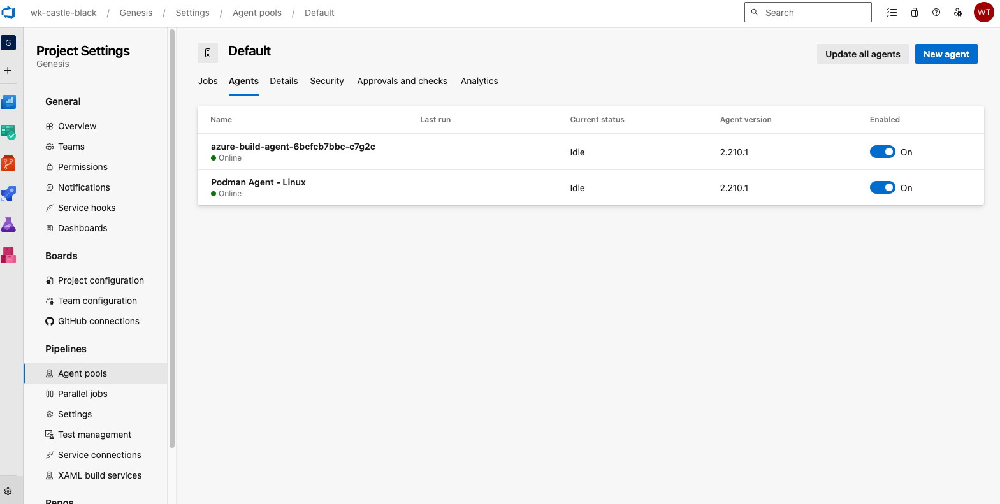

## Building Container Image of Azure Pipelines Agents
Detailed steps at [Azure DevOps official page](https://learn.microsoft.com/en-us/azure/devops/pipelines/agents/docker?view=azure-devops#create-and-build-the-dockerfile-1)

1. Copy and modify `start.sh` from the official site, or use the [modified file](https://github.com/rh-mobb/azure-pipelines-openshift/blob/main/assets/start.sh) provided in the [blog](https://cloud.redhat.com/experts/misc/azure-dev-ops-with-managed-openshift/) written by Kevin Collins 

1. Build the image
        
        cd podman/agent/

        podman build -t azp-agent:linux \
            -f Containerfile \
            --platform linux/amd64,linux/arm64 \
            --env AZP_AGENT_PACKAGE_LATEST_URL=https://vstsagentpackage.azureedge.net/agent/2.210.1/vsts-agent-linux-x64-2.210.1.tar.gz 

1. Try running the agent in Podman

        # setting the env var
        export AZP_URL=https://dev.azure.com/<Azure DevOps Org Name>
        export AZP_TOKEN=<personal access token in Azure DevOps>
        export AZP_POOL=<Agent Pool name, by default is 'Default'>

        # to remove the previous container
        podman rm azp-agent-linux

        podman run \
            -e AZP_URL=$AZP_URL \
            -e AZP_TOKEN=$AZP_TOKEN \
            -e AZP_POOL=$AZP_POOL \
            -e AZP_AGENT_NAME="Podman Agent - Linux" \
            --name "azp-agent-linux" azp-agent:linux

1. Check Azure DevOps Pipeline > Project Settings > Agent Pools > Agent
        

## OCP Internal Registry
1. Login to OCP

2. Enable route to internal image registry and get the URL

        oc patch configs.imageregistry.operator.openshift.io/cluster --patch '{"spec":{"defaultRoute":true}}' --type=merge

        export REGISTRY=`oc get route default-route -n openshift-image-registry --template='{{ .spec.host }}'`

1. (Manual) Push image to OpenShift Internal Image Registry

        oc new-project azure-build

        oc create imagestream azure-build-agent

        podman login -u <username> -p `oc whoami --show-token` ${REGISTRY}

        podman tag azp-agent:linux ${REGISTRY}/azure-build/azure-build-agent:latest

## Create Service Account
        oc create serviceaccount azure-build-sa
        oc create -f openshift/agent/serviceaccount/scc.yaml
        oc adm policy add-scc-to-user nonroot-builder -z azure-build-sa

        # Add image puller role for cross namespace img pulling
        oc policy add-role-to-user \
        system:image-puller \
        system:serviceaccount:azure-build-1:azure-build-sa \
        --namespace=azure-build

## Create Secrets
        oc create secret generic azdevops \                 
        --from-literal=AZP_URL=${AZP_URL} \
        --from-literal=AZP_TOKEN=${AZP_TOKEN} \
        --from-literal=AZP_POOL=${AZP_POOL}

## Deploy
        oc apply -k openshift/agent/azure-build-1
        oc apply -f openshift/agent/azure-build-1/rolebinding.yaml

## Delete
        kustomize build openshift/agent/azure-build-1 | oc delete -f -

## References
1. Azure DevOps with Managed OpenShift
- https://cloud.redhat.com/experts/misc/azure-dev-ops-with-managed-openshift
- https://github.com/rh-mobb/azure-pipelines-openshift

2. Hosting an Azure Pipelines Build Agent in OpenShift
- https://www.redhat.com/en/blog/hosting-an-azure-pipelines-build-agent-in-openshift  
- https://github.com/kevchu3/kevin-azure-pipelines-openshift